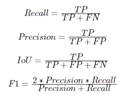

The aim of the Machine Vision Innovation (MVI) Tournament is to foster recent advances in image processing, computer vision, and machine learning to solve different open-ended real-world challenges. The participants will be solving one of the four problems described below. The best three teams will be awarded a cash prize, whereas all participating teams will be given certificates.  

## 1. Problems:

There are four different problems within the tournament. The participants can choose one of them to solve within the prescribed time frame. The summary of each problem is presented below, whereas their detailed descriptions are uploaded on the tournament website:

  

## Problem-1: Detecting and Predicting ArduCopter Sensory Failures through Advanced Signal and Image Processing with Machine Learning

Unmanned Aerial Vehicles (UAVs) play a crucial role in various applications, including surveillance, agriculture, and disaster response. The reliability and performance of UAVs heavily depend on the accurate functioning of their sensors. The ArduCopter platform, a popular choice for UAV enthusiasts and professionals alike, relies on a diverse set of sensors for navigation and stability. Detecting and predicting sensory failures in real-time is paramount for ensuring the safe and efficient operation of these UAVs.
This proposal aims to address the issue of ArduCopter sensory failures through the utilization of state-of-the-art signal processing, image processing, and machine learning techniques. We will leverage a comprehensive dataset that includes a variety of sensory inputs, encompassing accelerometer readings, gyroscope data, camera images, and other relevant information.

  

## Problem-2: Detecting Structural Cracks and Disorientations in Buildings and Construction Sites 

Ensuring the structural integrity and safety of buildings and construction sites is paramount in urban development. This proposal aims to address this critical aspect by detecting structural cracks and disorientations. Participants will be provided with a unique dataset that integrates visual data collected from various construction scenarios. The challenge will require participants to design innovative solutions using state-of-the-art image processing, computer vision, and machine learning schemes.

  

## Problem-3: Crops Recognition Using Visual Tactile Information

Precision agriculture is at the forefront of modern farming practices, and the accurate assessment of crop ripening conditions is crucial for optimizing yields. This proposal aims to address this agricultural imperative by leveraging visual tactile information to recognize crops under various ripening conditions. Participants will be provided with the dataset collected from different crops at different stages of ripening. The challenge described in this proposal requires participants to design innovative solutions utilizing state-of-the-art image processing, computer vision, and machine learning schemes.

  

## Problem-4: Detecting Aquatic Defects Using Underwater Imagery

The health of aquatic environments is critical for ecological balance and human well-being. This conference challenge aims to address this concern by focusing on the detection of aquatic defects through the analysis of underwater imagery. Participants will be provided with a specialized dataset comprising underwater images captured in various aquatic environments. The challenge calls for innovative solutions utilizing state-of-the-art image processing, computer vision, and machine learning schemes to detect different types of aquatic defects.

  

## 2. Tournament Phases:

The tournament will be conducted in two phases, where the description of each phase is presented below:

  

## Phase-1: Teams Registration and Problem Selection

In the first phase, the teams will register via Google Forms, and they will select the problem of their choice which they want to solve during the competition. The organizers will also share the datasets privately with the teams with proper legal contract about non re-distribution and non-sharing policies.

## Phase-2: Trained Models Submission and Final Evaluations:

In the second phase of the tournament, the participants will submit their codes and trained model weights with the organizers, and the organizers will evaluate their models on the private test dataset. The final evaluation scores and results will then be communicated to the teams. The top-3 winning teams will be given cash prizes during the ceremony. Moreover, all the participating teams will also be given certificates.

  

## 3. Datasets and Code Release Policies:

For each problem, the participants will be given a dataset to train their models, the test data will be hidden from the participants for fair evaluation purposes. The participants would be sharing their codes and trained model weights with the organizer who will evaluate the performance of their models. The evaluation scores will be communicated to the participants afterwards.

## 4. Evaluation Metrics:

The models will be evaluated using the following metrics:

  

## 5. Prizes and Certificates:

The top-3 teams will be given cash prizes, whereas all the participating teams will be given certificates of appreciation. The distribution of cash prizes w.r.t winning order are given below:

- 1st Position (Winner): $2,000
- 2nd Position (1st Runner-Up): $1,250
- 3rd Position (2nd Runner-Up): $750

## 6. Timeline:

- October 27th, 2024, 8:00AM-10:30AM: Registration and Breakfast, Problem Selection and Registration Closure (Phase-1)
- October 27th, 2024, 2:00PM-5:00PM: Training Dataset Release and Day Closure (Phase-1)
- October 28th, 2024, 8:00AM-5:00AM: Solution Preparation by the Teams (Phase-2)
- October 29th, 2024, 10:00AM: Submission of Code and Model Weights (Phase-2)
- October 29th, 2024, 5:00PM: Snacks and Results Announcement (Phase-2)
- October 30th, 2024, 5:00PM: Prize and Certificates Distribution Ceremony 

## 7. Eligibility Criteria:

Only students can register for the tournament in the form of teams. A single team can have a maximum of 2 people. The age of the students should be between 20-30 years. 

## 8. Registration:

|   | IEEE Student Member | SPS Student Member | Student Non-Member |
| ------------- | ------------- | ------------- | ------------- |
| MVI Tournament (Deadline: October 27th, 2024, 10:30AM)  | Free  | Free  | Free  |

Use the following form to complete the registration before the deadline (Google Sign-in Required).
[Registration Form](https://forms.gle/4kwGLyhGWfu2PVxY6)

## 9. Important Information:

Please note that the organizers will not be providing any hardware resources for model training, and validation. The teams will need to use their own hardware setup for training the models by accessing it through remote connection during the tournament. If any team lacks hardware resources in their lab/ university, then they are allowed to use free version of Google Colab to train the model and share it with us for evaluation purposes. For model implementation, only PyTorch is allowed.

## 10. Organizers:

- Dr. Taimur Hassan, ECE Department, Abu Dhabi University, UAE
- Prof. Jorge Dias, Department of Electrical Engineering, Khalifa University, UAE
 
